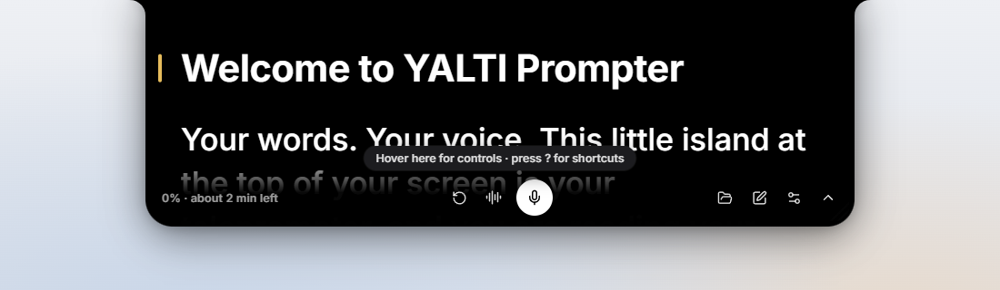
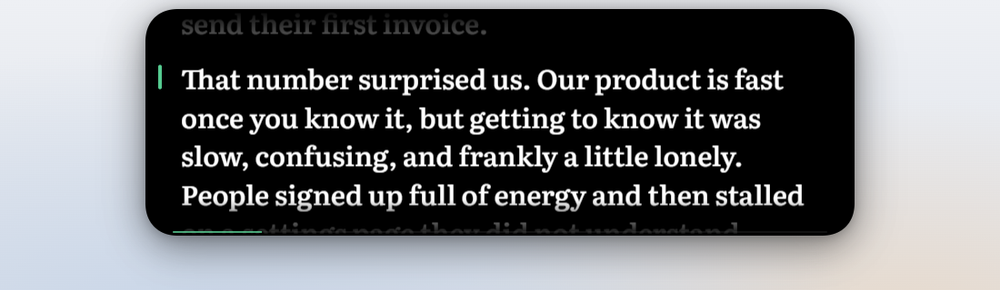
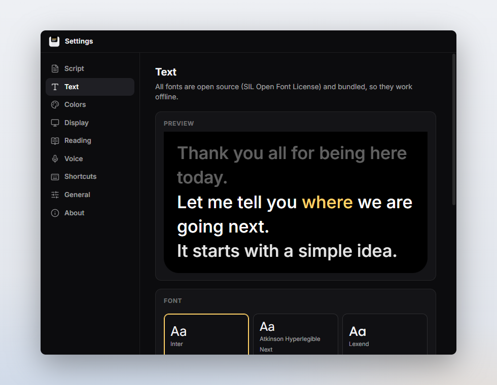
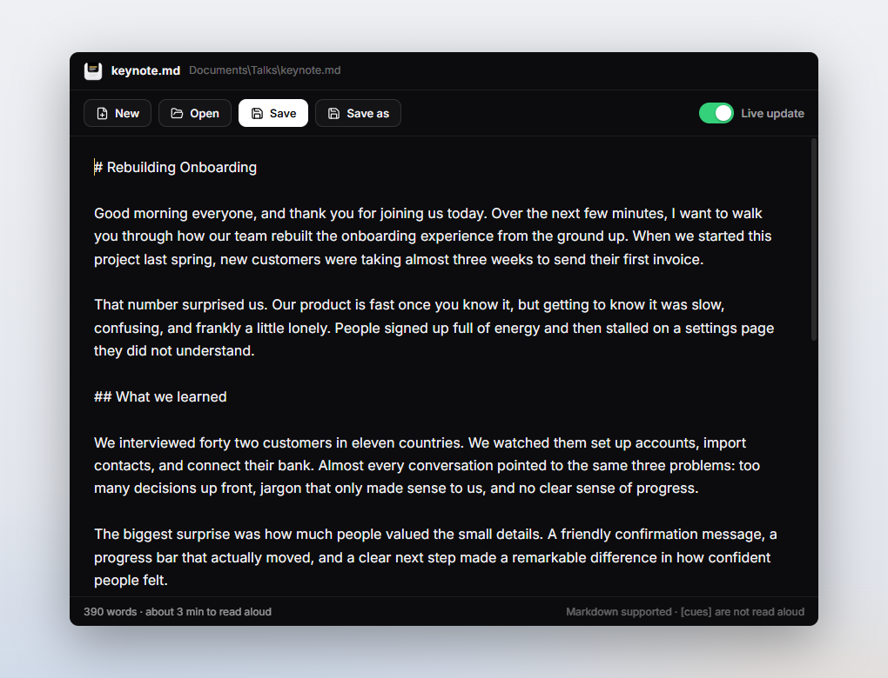

<p align="center">
  
</p>

<h1 align="center">YALTI Prompter</h1>
<p align="center"><b>Your words. Your voice.</b></p>
<p align="center">A minimalist, open-source teleprompter for Windows that flows out of the top of your screen and follows your voice — entirely offline.</p>

<p align="center">
  
</p>

---

YALTI Prompter sits at the top center of your screen, right under your webcam, as a soft dark
surface that seems to grow out of the bezel — inspired by the Dynamic Island. Load a script,
start speaking, and YALTI listens on your own computer and keeps the line you are reading in view.

It understands that people don't read perfectly. Pause, skip a sentence, repeat yourself, ad-lib,
or wander off-script for a story: YALTI waits, and when you come back to your words — even at a
completely different part of the script — it finds your place again.

## Features

- **Follows your voice.** Local, open-source speech recognition ([sherpa-onnx](https://github.com/k2-fsa/sherpa-onnx)) tracks where you are in the script. It handles skipped sentences, repeats, paraphrasing, long pauses, going off-script and resuming elsewhere, and only moves when it is confident. If it ever jumps somewhere you didn't mean, one click (or Backspace) takes you back.
- **A liquid island, not a window.** The prompter emerges from the top edge, expands, folds into a compact pill and retracts into the bezel with one continuous, spring-driven motion. Choose *Liquid*, *Flush* or *Floating* styles and tune the intensity.
- **Readable everywhere.** Nine bundled open-source fonts, adjustable size, weight, line and letter spacing, alignment, colors, highlight color, background opacity and reading-line position. Mirror mode for beam-splitter glass.
- **Scripts the way you write them.** Open `.txt`, `.md` (rendered cleanly — no Markdown symbols), `.srt` and `.vtt` files; paste from the clipboard; drop a file — or text highlighted in any app — on the island or in Settings; or write in the built-in editor. Files reload automatically when you save them elsewhere, and YALTI remembers where you were in each script. Text in `[square brackets]` becomes a quiet stage direction that is never tracked.
- **Auto-scroll and manual control** whenever you prefer: adjustable speed, optional countdown, mouse wheel, keys, or drag the text.
- **Out of your way.** Transparent areas click through to the apps beneath. Always-on-top (even over full-screen slides), system-tray access, and global shortcuts that work while another app has focus.
- **Private by design.** No accounts, no cloud, no telemetry, no recordings. Scripts and audio never leave your computer, and it works fully offline.
- **Open source throughout** — code (MIT), speech engine and model (Apache-2.0), fonts (OFL), icons (ISC). See [THIRD_PARTY_NOTICES.md](THIRD_PARTY_NOTICES.md).

## A closer look

| | |
| --- | --- |
|  |  |
| **Compact** — fold the prompter into a small pill with status and progress. | **Notifications** — the island briefly grows to tell you something. |
|  |  |
| **Quiet controls** appear only when you hover. | **Make it yours** — fonts, colors, size and the top-edge style. |
|  |  |
| **Settings** apply live while you adjust them. | **Built-in editor** updates the prompter as you type. |

## Download and install

Get the latest version from the [Releases page](https://github.com/silent-diffusion/YALTI-Prompter/releases/latest). No account or developer tools are needed.

| File | What it is |
| --- | --- |
| `YALTI-Prompter-Setup-x.y.z.exe` | **Recommended.** Installer for your user account (no administrator rights needed). Adds Start menu and desktop shortcuts and an uninstaller. |
| `YALTI-Prompter-Portable-x.y.z.exe` | Single-file portable app. Run it from anywhere (e.g. a USB stick); settings are stored next to it. |
| `YALTI-Prompter-x.y.z-win-x64.zip` | Portable folder. Unzip and run `YALTI Prompter.exe`. Starts faster than the single-file portable. |

Requirements: Windows 10 or 11 (64-bit) and a microphone for voice tracking.

> **Windows SmartScreen:** the release builds are not code-signed yet, so Windows may show
> “Windows protected your PC”. Choose **More info → Run anyway**. You can verify a download
> against the SHA-256 checksums published with each release.

**Uninstall** from *Settings → Apps → Installed apps → YALTI Prompter*, or with the uninstaller in the Start menu. Your settings stay in `%APPDATA%\YALTI Prompter` unless you delete that folder.

## Quick start

1. **Launch YALTI Prompter.** The island flows out of the top of your screen with a short welcome script.
2. **Open your script** with **Ctrl+O**, paste one with **Ctrl+V**, or drop a `.txt` / `.md` file — or highlighted text — on the island.
3. **Press Space** (or the microphone button) and start reading aloud. YALTI follows along.

Hover over the island to reveal the controls. Press **?** for every shortcut.

## Everyday controls

| Action | In the prompter | From anywhere (global) |
| --- | --- | --- |
| Start / pause (listen or auto-scroll) | `Space` | `Ctrl+Alt+S` |
| Voice tracking on / off | `M` | `Ctrl+Alt+M` |
| Show / hide the prompter | `H` | `Ctrl+Alt+Y` |
| Expand / collapse | `Enter` / `Esc` | `Ctrl+Alt+Enter` |
| Scroll a line / a page | `↑` `↓` / `PgUp` `PgDn` | `Ctrl+Alt+PgUp` / `Ctrl+Alt+PgDn` |
| Slower / faster auto-scroll | `[` / `]` | `Ctrl+Alt+-` / `Ctrl+Alt+=` |
| Back to the start / end | `Home` / `End` | `Ctrl+Alt+Home` |
| Jump back after voice tracking jumps | `Backspace` | `Ctrl+Alt+Backspace` |
| Text size | `Ctrl` `+` / `Ctrl` `−` | |
| Open · Paste · Edit · Reload script | `Ctrl+O` · `Ctrl+V` · `Ctrl+E` · `Ctrl+R` | |
| Settings | `Ctrl+,` | |

Global shortcuts can be changed or turned off in *Settings → Shortcuts*. Drag the island
sideways to move it along the top edge; drag either bottom corner to resize it.

The full guide is in [docs/USER_GUIDE.md](docs/USER_GUIDE.md).

## How voice tracking works

YALTI keeps the last few recognized words and aligns them against the *whole* script with a
fuzzy, phonetics-aware alignment that tolerates misheard, skipped, extra, merged and split words.
Nearby continuation is cheap; moving far away needs strong, unambiguous evidence that repeats over
several words; and when recent speech matches nothing, YALTI holds still and quietly shows that it
is listening for your script. Details and tuning notes are in [docs/ARCHITECTURE.md](docs/ARCHITECTURE.md).

Everything runs locally: a 70 MB streaming speech model (English) uses about 5–10 % of one CPU core
while you speak and is unloaded a few minutes after you stop.

## Building from source

```bash
git clone https://github.com/silent-diffusion/YALTI-Prompter.git
cd YALTI-Prompter
npm ci
npm run fetch-model   # downloads and verifies the speech model (~73 MB)
npm start
```

Create the installer, portable app and zip in `dist/` with `npm run dist`. Prerequisites, tests
and release steps are in [docs/BUILDING.md](docs/BUILDING.md) and [docs/RELEASING.md](docs/RELEASING.md).

## Technology

- [Electron](https://www.electronjs.org/) with plain HTML, CSS and JavaScript modules — no UI framework
- [sherpa-onnx](https://github.com/k2-fsa/sherpa-onnx) streaming Zipformer transducer for on-device recognition, running in an isolated utility process
- [marked](https://marked.js.org/) for parsing Markdown scripts
- [Fontsource](https://fontsource.org/) variable fonts and [Lucide](https://lucide.dev/) icons
- [electron-builder](https://www.electron.build/) + NSIS for the installer

Every runtime dependency and its license is listed in [THIRD_PARTY_NOTICES.md](THIRD_PARTY_NOTICES.md),
and `npm run check-licenses` verifies them against an open-source allowlist.

## Contributing

Bug reports, ideas and pull requests are welcome — see [CONTRIBUTING.md](CONTRIBUTING.md) and our
[Code of Conduct](CODE_OF_CONDUCT.md). Please report security issues privately as described in
[SECURITY.md](SECURITY.md).

## License

YALTI Prompter is released under the [MIT License](LICENSE). Bundled third-party components keep
their own open-source licenses; see [THIRD_PARTY_NOTICES.md](THIRD_PARTY_NOTICES.md).
